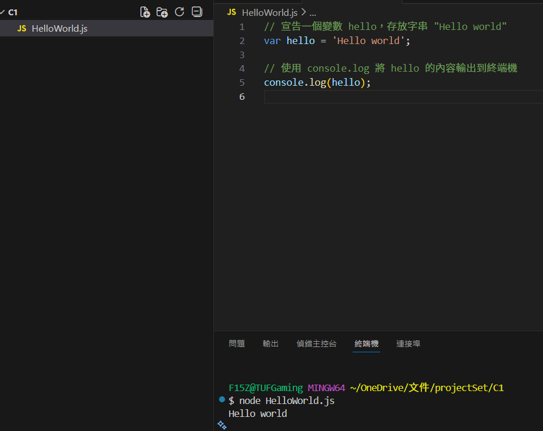

# 第1次作業-作業-HW1
>
>學號：112111108
> 
>姓名：詹羽庭
> 
>作業撰寫時間：60mis
> 
>最後撰寫文件日期：2026/01/05
>

本份文件包含以下主題：(至少需下面兩項，若是有多者可以自行新增)
- [x] 說明內容
- [x] 個人認為完成作業須具備觀念

## 說明程式與內容

1. 請實作同名稱檔案並將程式碼實作並印出其結果，其內容為Topic 1 投影片的第12~13頁。

Ans:
建立 `HelloWorld.js` 檔案，並於檔案中撰寫簡單的 JavaScript 程式碼。  
程式內容為先宣告一個變數 `hello`，其值為字串 `"Hello world"`，再透過 `console.log()` 將變數內容輸出至終端機。
完成程式後，於 VS Code 中開啟終端機，使用 `node HelloWorld.js` 指令執行程式，成功在終端機畫面中顯示 `Hello world`，代表 Node.js 已正確執行 JavaScript 程式。

## 完成作業須具備觀念
1. 了解 Node.js 是一個可在電腦端執行 JavaScript 的執行環境，並非在瀏覽器中執行。
2. 能夠理解 `node` 指令的用途，是用來啟動 Node.js 並執行指定的 JavaScript 檔案。
3. 清楚目前終端機所在的工作目錄，確保執行的 `.js` 檔案位於正確的資料夾中。
4. 知道 JavaScript 檔案中的程式碼會依序執行，並可透過 `console.log()` 將結果輸出至終端機畫面。
